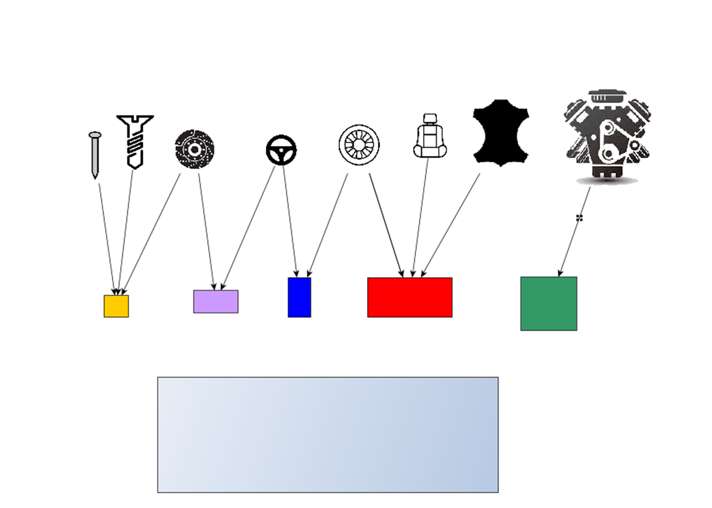
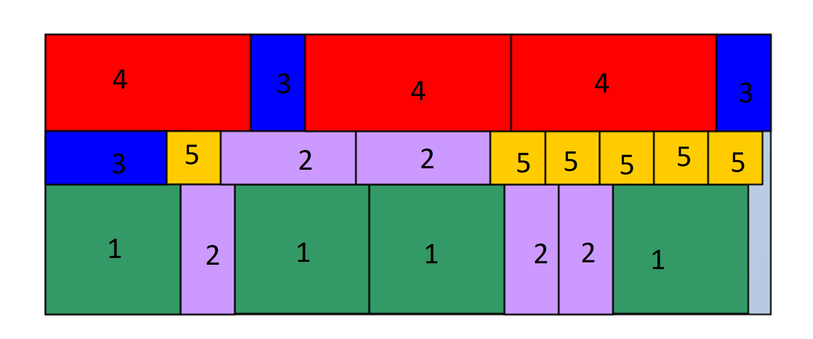
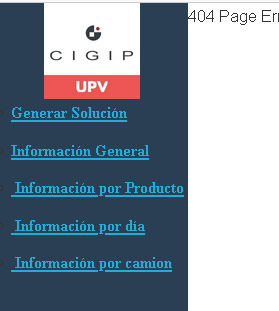

# Guía de uso
La siguiente guía de uso explica como utilizar la aplicación Web Inventory-Loading-Manager.

## Explicación General
### Introducción
El objetivo de esta herramienta es determinar la cantidad de productos que deben ser trasladadas 
desde un proveedor a una fábrica dependiendo del inventario actual de la fábrica y
la demanda de este producto durante un periodo de tiempo determinado.

Objetivos generales y requisitos en los que se basa la herramienta:
* Determinar el número de camiones y la distribución interna de los contenedores, teniendo en cuenta las restricciones dadas por las dimensiones de los contenedores y de los camiones.
* Los contenedores están divididos en diferentes tipos, y conocemos la altura, longitud y anchura de los mismos. Se permiten rotaciones de 90 grados con respecto al eje z.
* En cada contenedor sólo se transporta en él un tipo de producto. 
Se conoce el número de piezas que caben en un contenedor y el peso del contenedor 
cargado. Algunos productos pueden enviarse en diferentes tipos de contenedores. 
* El inventario disponible para cada producto debe cumplir una cobertura de inventario mínima, determinada por la demanda de ese producto para los próximos tres días y el inventario actual.
* El plan maestro de producción determina la demanda de cada producto que debemos abastecer a la fabrica. Por lo tanto, la demanda de cada producto es un valor conocido.
 

En nuestro modelo, cada producto se envía en un contenedor.
Un contenedor sólo puede transportar un tipo de producto a la vez.  
Un producto puede ser enviado por más de un tipo de contenedor.  
La siguiente imagen sirve de ejemplo.
Tenemos cinco tipos de contenedores, representados por diferentes colores,
y ocho tipos de productos. 
La flecha representa si podemos enviar el producto en el contenedor. 

Como podemos ver, un tipo de contenedor puede transportar más de un 
tipo de producto. 
Sin embargo, un contenedor sólo puede transportar un tipo de producto.
El número de productos que puede transportar es un valor conocido.

 
En estos momentos, estamos suponiendo que solo podemos apilar contenedores del mismo tipo,
pero pueden cargar diferentes productos. Por ejemplo, la siguiente imagen muestra la vista de planta
de una posible distribución de contenedores en un camión. 

Los números representan el número de cajas apiladas. Como vemos, podemos posicionar un contenedor en dos orientaciones diferentes.

### Modelo de datos
Datos de entrada:
* Datos del producto: número de unidades que caben en un determinado contenedor y peso de cada producto.
* Datos del contenedor: dimensiones del contenedor y peso.
* Datos de inventario: Inventario inicial de cada producto o materia prima.
* Datos de transporte: Número de camiones disponibles, sus dimensiones y el peso máximo que pueden transportar.

Datos de salida:
* El número de camiones para cada día.
* El nivel de inventario de cada producto en la fábrica, dado que se cumple el plan de producción.
* La distribución de contenedores de cada camión.

## Descripción de la aplicación
 En la parte izquierda de la aplicación web, se encuentra el menú de navegación.

Tenemos cinco opciones diferentes:
* **Generar Solucion**: Mediante esta página se cargan los datos y se obtiene la solución.
* **Informacion General**: En esta página se muestra el número total de camiones por día.
* **Informacion por Producto**: En esta página se muestra el inventario y el inventario de seguridad por producto.
* **Informacion por dia**: En esta página se muestra la cantidad de tipos de cajas con su producto asociado que se 
envían en cada camión.
* **Informacion por Camión**: Muestra la distribución de cada camión de forma gráfica.

### Cargar datos y generar solución
Para cargar los datos, tenemos que ir a la página **Generar Solución**.
Una vez en esta página, debemos de cargar los datos de entrada en el formato correcto.
Debemos de subir un archivo .zip.  Este debe de contener una carpeta llamada **datasets**.
Las carpetas que se encuentran dentro de esta carpeta determinan las instancias/escenarios que se van a resolver.
En cada una de estas carpetas debe encontrarse cuatro archivos .csv con los datos de entrada.
Estos son:
* **Demanda.csv**: Contiene la demanda de cada producto para cada día.
* **Dimensiones_Camiones.csv**: Contiene las dimensiones de cada camión.
* **Dimensiones_Contenedores.csv**: Contiene las dimensiones de cada contenedor.
* **Productos.csv**: Contiene toda la información necesaria de cada producto.

Por tanto la estructura del archivo .zip debe ser la siguiente:
* datasets.zip
    * datasets
        * instancia1
            * Demanda.csv
            * Dimensiones_Camiones.csv
            * Dimensiones_Contenedores.csv
            * Productos.csv
        * instancia2
            * Demanda.csv
            * Dimensiones_Camiones.csv
            * Dimensiones_Contenedores.csv
            * Productos.csv
#### Demanda.csv
El archivo **Demanda.csv** debe de tener la siguiente estructura:
i,t,Demanda

Donde:
* i: Identificador del producto.
* t: Día de la demanda.
* Demanda: Cantidad de producto demandada.

Hay que tener en cuenta que hay que especificar la demanda de cada producto para cada día,
aunque la demanda sea 0. Por ejemplo, si tenemos 3 productos y 5 días, el archivo debe tener 15 líneas.

#### Dimensiones_Camiones.csv
El archivo **Dimensiones_Camiones.csv** debe de tener la siguiente estructura:
id,Length,Width,Heigth

Donde:
* id: Identificador del camión.
* Length: Longitud del camión.
* Width: Anchura del camión.
* Heigth: Altura del camión.

#### Dimensiones_Contenedores.csv

El archivo **Dimensiones_Contenedores.csv** debe de tener la siguiente estructura:
id,Length,Width,Heigth

Donde:
* id: Identificador del contenedor.
* Length: Longitud del contenedor.
* Width: Anchura del contenedor.
* Heigth: Altura del contenedor.

#### Productos.csv

El archivo **Productos.csv** debe de tener la siguiente estructura:
id,i,id_container,items_per_container,Stock,Days_Stock_Coverage,name_of_product,CosteStock

Donde:
* id: Identificador del producto.
* i: Identificador del producto.
* id_container: Identificador del contenedor.
* items_per_container: Número de unidades que caben en un contenedor.
* Stock: Inventario inicial del producto.
* Days_Stock_Coverage: Cobertura de inventario mínima.
* name_of_product: Nombre del producto.
* CosteStock: Coste de mantener un producto en stock.

Una vez cargados los datos, se puede generar la solución.
Para ello, apretamos el botón **Generar Solución**. Esto generará
todas las soluciones de los escenarios que se encuentren en el archivo .zip.
Una vez generadas las soluciones, se puede acceder a la información de cada escenario mediante las otras opciones del 
de navegación

